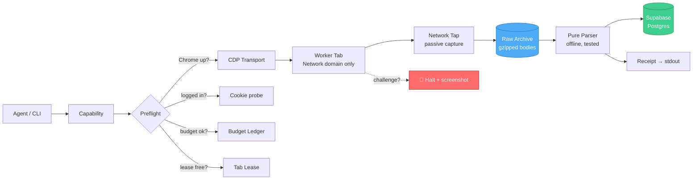

<div align="center">

# 🛰️ LinkedinLeadsOS

### A safety-first TypeScript toolkit that lets a coding agent *read* LinkedIn end to end — with no human in the loop.

Profiles · Companies · Posts · Jobs · Sales Navigator — captured from the operator's **own logged-in Chrome**, archived raw, parsed offline, and stored in Postgres.

<br/>

<!-- Tech -->


<!-- Quality -->


-blue?style=flat-square)

</div>

---

> [!IMPORTANT]
> **This is a read-only research toolkit.** It captures only the data pages the operator's own browser already fetched, never forges a request LinkedIn's UI did not issue, and performs **zero** writes (no connect, message, comment, follow, or view). The one account it drives is treated as irreplaceable — every design choice below exists to protect it.

<br/>

## 📖 Table of Contents

- [Why this exists](#-why-this-exists)
- [The hard constraint](#-the-hard-constraint-one-account)
- [What it does](#-what-it-does)
- [How it works](#️-how-it-works-architecture)
- [How reliability is guaranteed](#-how-reliability-is-guaranteed)
- [Quick start](#-quick-start)
- [Usage](#-usage)
- [Exit codes](#-exit-codes)
- [Project layout](#-project-layout)
- [Engineering principles](#-engineering-principles)

<br/>

## 🎯 Why this exists

Outbound lead research is mechanical, repetitive, and slow when done by hand — but the tools that automate it either **burn accounts** (headless bots hammering forged API calls) or **hand back garbage** (brittle DOM scrapers that silently drift the day LinkedIn ships a redesign).

**LinkedinLeadsOS takes the opposite bet:** treat the one LinkedIn account as irreplaceable, drive the operator's *real* logged-in Chrome exactly as a human would, and take data only from the network responses that browser already loaded. The result is a library of pure, testable capability functions that an AI agent can call to read LinkedIn — reliably, observably, and without ever putting the account at risk.

**The purpose:** a foundation an agent can build campaigns on *later*, where the read layer is boring, correct, and trusted — so nothing downstream has to wonder whether the data is real.

<br/>

## 🔒 The hard constraint: one account

There is exactly **one** LinkedIn account and it cannot be burned.

Every decision that looks paranoid exists because of this. When a trade-off pits speed against account safety, **safety wins** — and that argument is closed.

<table>
<tr><td>🕵️ <b>Undetectable driving</b></td><td>Never <code>Runtime.enable</code> or <code>Page.enable</code> — <code>consoleAPICalled</code> is the classic CDP detection leak. Only the <code>Network</code> domain is ever enabled.</td></tr>
<tr><td>🚫 <b>No forged requests</b></td><td>No direct Voyager calls with the session cookie, however tempting. Only bodies the UI itself fetched are read.</td></tr>
<tr><td>🖱️ <b>Human input</b></td><td>Mouse moves follow eased Bézier curves with jitter and occasional overshoot; scroll wheels dispatch real notches. No motion is a constant.</td></tr>
<tr><td>💰 <b>Budget ledger</b></td><td>Hard hourly/daily caps on page loads, searches, and profile opens — enforced atomically and impossible to bypass with a flag.</td></tr>
<tr><td>🛑 <b>Challenges halt</b></td><td>A captcha or checkpoint is never solved automatically. Screenshot, checkpoint state, exit, stop.</td></tr>
</table>

<br/>

## ✨ What it does

Scope is deliberately narrow — **read-only** — and everything outside it is explicitly out of bounds for this phase.

| Layer | What | Status |
|---|---|:---:|
| **L0** — Session & infra | Chrome launch, CDP transport, tab leasing, run context, raw archive, budget ledger | ✅ Built |
| **L1** — Cheap reads | `profile.get`, `profile.capture`, health & log queries | ✅ Built |
| **L2** — Metered searches | Sales Navigator searches (budget-gated) | 🧭 Designed |
| **L3+** — Writes / intelligence / orchestration | connect, message, ICP scoring, campaigns | 🚫 Out of scope |

### Capabilities shipped today

```
health.check    → M1 gate: Chrome up, CDP alive, logged in, budget & lease clear
profile.get     → M3 gate: read one profile end to end (freshness → capture → parse → store)
profile.capture → human-paced cold-load + raw DOM snapshot archive
log.runs        → list recent runs
log.why         → explain what one item did
log.errors      → surface a run's failures
log.drift       → track parser drift over time
```

<br/>

## 🏗️ How it works (architecture)

Each capability is one directory (`index.ts` · `parse.ts` · `parse.test.ts` · `README.md`). The CLI discovers them by scanning the folder — adding a capability is adding a directory, with no wiring to forget.



### The data flow, in one breath

1. **Preflight** checks Chrome → CDP → login → budget → lease → worker tab, in that order, failing fast with a specific exit code.
2. The **worker tab** attaches with *only* the `Network` domain enabled and asserts focus emulation before anything renders.
3. The **network tap** passively watches — it enables nothing, and reads only bodies the page fetched itself.
4. Every body is **archived raw (gzipped) before it is parsed**. The parsed row is a projection, never the only copy.
5. A **pure parser** turns the archive into typed rows, offline, provably, with zero LinkedIn requests.
6. Results land in **Supabase**; a compact **receipt** prints to stdout.

<details>
<summary><b>🔬 The one deliberate exception — the profile reader reads the DOM (click to expand)</b></summary>

<br/>

The iron rule is *"data comes from captured network bodies, never the rendered DOM."* The profile reader is the **single** exception, and it exists because it was **measured**, not assumed:

> No Voyager endpoint carries a *stranger's* profile on a cold load. The one that looked like it did (`voyagerIdentityDashProfiles`) takes the operator's *own* urn as input and returns the operator — proven across four live loads.

So the profile reader takes both **identity** and **content** from a **DOM snapshot** (`outerHTML` captured after layout settles, archived raw, parsed offline):

- **Identity** resolves from agreement across the SDUI profile-card ref namespace (`com.linkedin.sdui.profile.card.ref<PROFILE_ID><CardName>`). It either resolves or returns `null` — it never guesses. A capture with no resolvable identity stores **nothing** rather than storing content under an invented key.
- **Content** is scoped to the subject's own cards by that same namespace, which is what keeps a "people also viewed" stranger out of the record.

Every DOM-sourced row is tagged as such so nothing downstream mistakes it for a labeled API field. This exception is the profile reader and **nothing else**.

</details>

<br/>

## 🛡️ How reliability is guaranteed

This is the part that matters for a system that touches an irreplaceable account. Reliability here is not "it passed once" — it is a set of enforced properties.

### ✅ Parsers are pure and tested offline

A parser change is provable against fixtures with **zero LinkedIn requests**. The suite runs **797 tests, all passing**, `tsc` clean — and tests are verified to *bite* by mutation (deliberately breaking the code and confirming a test fails).

### 📦 Raw first, always

The untouched response body is gzipped to disk *before* anything parses it. If a parser drifts, the raw archive is still there to re-parse. Nothing is ever the only copy.

### 🧾 Failure is a class, not a surprise

Every failure carries an exit code that names *what an operator should do about it* — retry, re-auth, back off, or stop cold. No error is silent, and no partial write leaves a record that looks complete when it isn't.

### 🔁 Races are designed out, not hoped away

The tab lease, the budget ledger, and the store write path were each hardened after live review found real bugs:

<details>
<summary><b>Examples of caught-and-fixed correctness bugs (click to expand)</b></summary>

<br/>

- **Tab lease** — the first version let two racers both reclaim a stale lease; rewritten so exactly one wins by filesystem rename semantics. *Verified with four real racing processes on one lockfile.*
- **Budget ledger** — a read-evaluate-write under a lockfile mutex so two racing spends can't both observe "under limit". *Verified: ten spends racing a limit of five land exactly five records.*
- **Store write path** — the person row is written **last**, because `last_seen` is its claim to be complete; a mid-write failure now leaves the record *stale* (and self-healing next run) instead of *fresh but half-written*.
- **Network tap** — an early bug could evict our own in-flight capture and drop a body with no miss recorded; both loss paths now record an explicit `abandoned` miss.

</details>

### 🔭 Everything is observable

Every run writes an NDJSON event log, a raw archive, screenshots on halt, and a `summary.json`. The `log.*` capabilities query it all back. Nothing happens that can't be explained after the fact.

<br/>

## 🚀 Quick start

> [!NOTE]
> **Prerequisites:** Node.js 26+, a Chrome install, a local [Supabase](https://supabase.com/docs/guides/cli) stack, and a LinkedIn account you are authorized to automate on a **dedicated Chrome profile**.

```bash
# 1. Install
git clone https://github.com/<you>/LinkedinLeadsOS.git
cd LinkedinLeadsOS
npm install

# 2. Configure the store
cp .env.example .env         # fill in your local Supabase keys
npm run db:start             # boot the local Postgres stack
npm run db:reset             # apply the M1–M3 schema
npm run db:verify            # prove the schema, grants, and RLS are correct

# 3. Verify the toolkit
npm test                     # 797 offline tests, zero LinkedIn requests
npm run typecheck            # tsc --noEmit, clean
```

### Launch the dedicated Chrome

Chrome runs on an **isolated automation profile** — never the operator's personal Chrome, never port `9222`.

```bash
# The automation profile lives at ~/.linkedin-os/chrome-profile on port 9223
"/Applications/Google Chrome.app/Contents/MacOS/Google Chrome" \
  --remote-debugging-port=9223 \
  --user-data-dir="$HOME/.linkedin-os/chrome-profile"
# Log into LinkedIn once, by hand, in that window.
```

### First run — health check (the M1 gate)

```bash
npm run cap -- health.check
# → ok, exit 0: Chrome up, CDP alive, login cookie present, budget clear, lease free
```

<br/>

## 💻 Usage

Every capability is invoked through one CLI. `cap list` emits a full machine-readable manifest (args, cost, risk, exit codes).

```bash
# Discover everything the toolkit can do
npm run cap -- cap list

# Read one profile end to end (freshness → capture → parse → store)
npm run cap -- profile.get --url=https://www.linkedin.com/in/some-person/
npm run cap -- profile.get --url=some-person --max-age=0      # force a fresh fetch
npm run cap -- profile.get --url=some-person --no-store       # capture + parse, no DB write
npm run cap -- profile.get --url=some-person --dry-run        # open no browser at all

# Inspect what happened
npm run cap -- log.runs                    # recent runs (default: last 24h)
npm run cap -- log.why --run=<id> --item=<item>
npm run cap -- log.errors --run=<id>
npm run cap -- log.drift                   # parser drift over the last 7d
```

<details>
<summary><b>🎛️ Universal flags (apply to every capability)</b></summary>

<br/>

| Flag | Meaning |
|---|---|
| `--run-id=` | resume or name a run |
| `--dry-run` | plan only; opens no browser, takes no lease |
| `--fields=` | project the receipt to named fields |
| `--no-store` | do everything except the Supabase write |
| `--budget=N` | lower this invocation's page-load allowance (can only *lower*, never raise) |
| `--force-release` | drop a wedged tab lease after naming its holder on the receipt |

</details>

<br/>

## 🚦 Exit codes

The exit code *is* the operator instruction. No guessing.

| Code | Class | What to do |
|:---:|---|---|
| `0` | ✅ OK | Nothing — it worked |
| `2` | 🛑 Challenge | A captcha/checkpoint appeared. Screenshot saved. Handle by hand. |
| `3` | ⏳ Rate-limited | Back off and retry later |
| `4` | 🔑 Auth dead | Re-login on the automation profile |
| `5` | 📐 Parse drift | LinkedIn changed shape; the parser needs updating (raw body is archived) |
| `6` | 🔁 Transient | Retry — a lease was held, a probe blipped, etc. |
| `7` | 💰 Budget exhausted | The account's safety cap for the window is reached. Wait. |

<br/>

## 🗂️ Project layout

```
LinkedinLeadsOS/
├── src/
│   ├── capabilities/          # one directory per capability (index · parse · test · README)
│   │   ├── health.check/
│   │   ├── profile.capture/
│   │   ├── profile.get/
│   │   └── log.{runs,why,errors,drift}/
│   ├── cli/                   # registry, flags, preflight, runner — the thin CLI
│   └── core/                  # chrome · cdp · session · tap · archive · budget · store · ...
├── docs/
│   ├── specs/                 # approved designs
│   └── capabilities/          # one contract doc per capability
├── supabase/                  # local config + M1–M3 migration + schema verifier
├── tests/                     # offline suite (fixtures, fakes, mutation-checked)
├── DECISIONS.md               # 90 dated, append-only design decisions — the "why"
├── STATE.md                   # built / in-progress / next, updated at every checkpoint
└── BACKLOG.md                 # deferred work with the approach settled at capture time
```

<br/>

## 🧭 Engineering principles

This project is as much a **discipline of recording** as a codebase. The rules it holds itself to:

- **Network tap is the source of truth** — data fields come from captured response bodies, with exactly one measured, documented exception (the profile reader's DOM snapshot).
- **Raw first** — archive the untouched body before parsing. Parsed rows are a projection, never the only copy.
- **Parsers are pure and provable offline** — a parser change must be defensible with zero LinkedIn requests.
- **The budget ledger cannot be bypassed by a flag.**
- **Challenges are never solved automatically** — screenshot, checkpoint, stop.
- **Write it down the moment it happens** — every real decision lands in [`DECISIONS.md`](DECISIONS.md) (append-only, dated), every checkpoint in [`STATE.md`](STATE.md). Memory is not trusted across sessions.

<br/>

<div align="center">

**Built as a study in doing the boring, safety-critical read layer *right*** — so everything above it can be trusted.

<sub>Read-only · one account · safety over speed · every claim tested.</sub>

</div>
